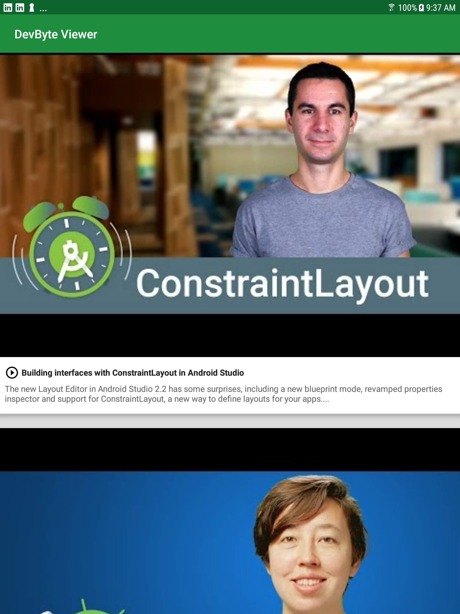

# Behind the Scenes - DevByte Viewer App

This is the toy app for Lesson 9 of the [Android App Development in Kotlin course on Udacity](https://classroom.udacity.com/courses/ud9012).

## DevByte

DevByte Viewer is an example app that showcases using 
[Room](https://developer.android.com/topic/libraries/architecture/room) and a Repository to create
an offline cache.

In addition, it also covers how to use 
[WorkManager](https://developer.android.com/topic/libraries/architecture/workmanager) for scheduling
periodic work. In this app it's used to setup a daily background data sync.

## Screenshots

