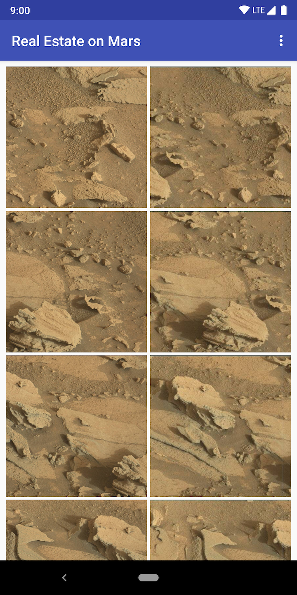

## MarsRealEstate

MarsRealEstate is a simple demo app using ViewModel & LiveData with Retrofit, Glide and Moshi in Kotlin.

This app demonstrates the following views and techniques:

* [Retrofit](https://square.github.io/retrofit/) to make api calls to an HTTP web service
* [Moshi](https://github.com/square/moshi) which handles the deserialization of the returned JSON to Kotlin data objects 
* [Glide](https://bumptech.github.io/glide/) to load and cache images by URL.
  
It leverages the following components from the Jetpack library:

* [ViewModel](https://developer.android.com/topic/libraries/architecture/viewmodel)
* [LiveData](https://developer.android.com/topic/libraries/architecture/livedata)
* [Data Binding](https://developer.android.com/topic/libraries/data-binding/) with binding adapters
* [Navigation](https://developer.android.com/topic/libraries/architecture/navigation/) with the SafeArgs plugin for parameter passing between fragments

## Screenshots

